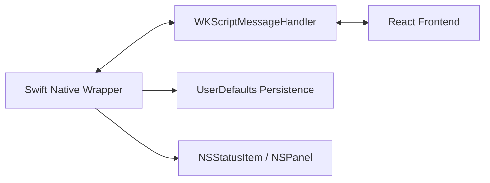

# Technical Codebase Documentation

This document serves as an onboarding guide for developers contributing to the Pomodoro macOS app.

## 1. System Architecture
The app uses a **Hybrid Architecture** combining a native Swift wrapper with a React + TypeScript frontend. This provides full control over native macOS behaviors (tray icons, non-activating panels) while allowing for rapid UI development with modern web tools.

### High-Level Flow


## 2. Directory Structure
```text
.
├── macos/Pomodoro/         # Native Swift Project (Swift Package Manager)
│   ├── Sources/            # Native source code
│   │   ├── Bridge.swift    # Handle messages from JS to Swift
│   │   ├── WindowController.swift # NSPanel & WKWebView setup
│   │   └── StatusBarController.swift # Tray icon & right-click menu
├── src/                    # React Frontend
│   ├── core/               # Pure logic (Timer, Session logic)
│   ├── state/              # Global state (Zustand stores)
│   ├── services/           # Bridge & Persistence abstractions
│   └── ui/                 # React components & Design System
├── build_app.sh            # Universal build & bundle script
└── index.html              # Entry point with SVG grain filter
```

## 3. The Native Bridge
Communication between JavaScript and Swift happens through a custom bridge.

### JS to Swift (`src/services/nativeBridge.ts`)
The `NativeBridge` object wraps `window.webkit.messageHandlers.native.postMessage`.
- `saveState(json)`: Writes app state to native `UserDefaults`.
- `loadState()`: Requests state from disk.
- `updateMenuBar(text)`: Changes the status item title in the macOS menu bar.
- `playClickSound()`: Triggers native `NSSound` playback.

### Swift to JS (`macos/Pomodoro/Sources/Bridge.swift`)
Messages are sent back to React using `webView.evaluateJavaScript("window.receiveNativeMessage(...)")`.
- **Action**: `loadedState` - Hydrates the frontend on launch.
- **Action**: `menuAction` - Responds to right-click tray menu clicks (Skip, Reset, etc.).

## 4. State Management & Persistence
The app uses **Zustand** for state, split into three focused stores:
1. `pomodoroStore.ts`: Handles the timer, session cycles, and logic triggers.
2. `taskStore.ts`: Manages the focus task list and project tags.
3. `statsStore.ts`: Handles real-time logging and historical data aggregation.

**Persistence**: The `PersistenceService` subscribes to all three stores and debounces saves by 1 second. It bundles the state into a single JSON object which is then passed to the Swift layer for permanent storage.

## 5. Build & Distribution
The project is built using a custom `build_app.sh` script which automates:
1. Building the React frontend via Vite.
2. Compiling the Swift executable.
3. Creating the `.app` bundle structure.
4. Converting `icon.png` into a native `.icns` file.
5. Ad-hoc signing the bundle (`codesign`) to enable system notifications.

**Developer Mode**: In `WindowController.swift`, the app detects if it's running in Xcode or a debug build and automatically loads `localhost:5173` instead of the bundled files for Hot Module Replacement.

## 6. Design System
- **Grid**: Base-8 grid system for all spacing and dimensions.
- **Typography**:
    - **DM Sans**: Used for branding, headers, and reports.
    - **Inter**: Used for utility, timer digits (tabular), and small text.
- **Visuals**: Styled with inline CSS objects for maximum portability and dynamic interaction (like the breath-sync blob animation).

