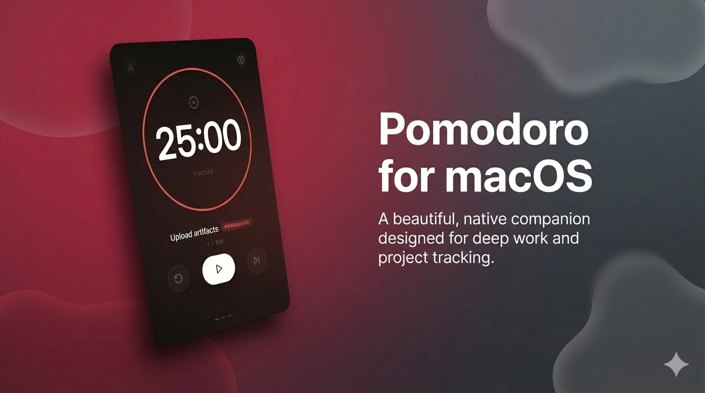
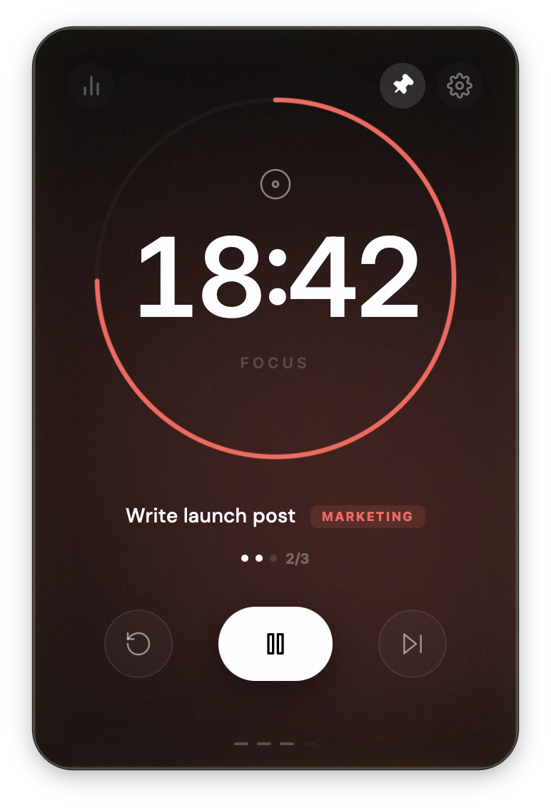
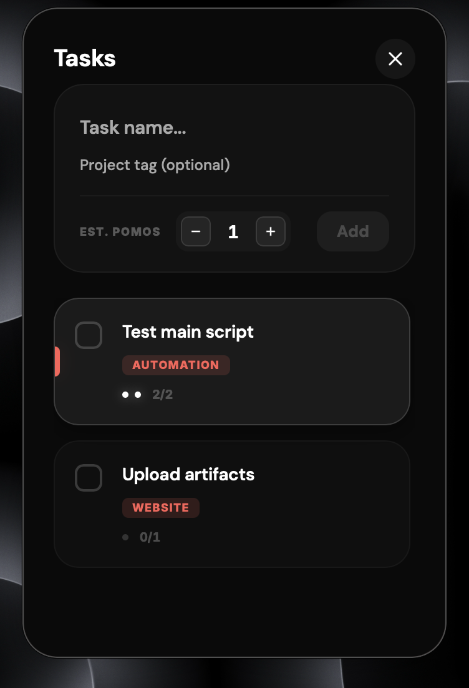
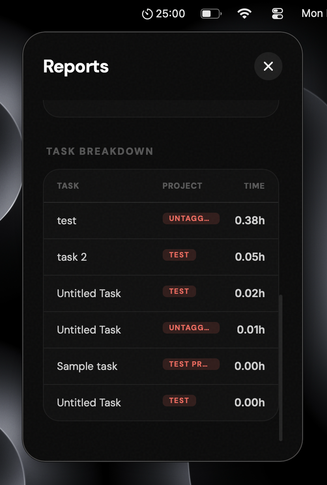

# 🍅 Pomodoro for macOS


A beautiful, native Pomodoro companion for macOS designed to help you stay focused and track your progress across projects.


---

## 🚀 Initial Launch (Beta)
This is the initial public release of Pomodoro for macOS. We are currently in beta, focused on delivering a rock-solid core experience for deep thinkers and developers.

---

## 💾 Download

### [Download Latest Release (.zip)](https://github.com/saranshbarua/pomodoro/releases/latest/download/Pomodoro_macOS_Universal.zip)

To install and run the app:
1. Download the `Pomodoro_macOS_Universal.zip` from the link above.
2. Unzip the file to your **Applications** folder.
3. **Right-click** `Pomodoro.app` and select **Open**.
4. Click **Open** again in the security dialog (this is required for the first launch as the app is currently ad-hoc signed).

> [!TIP]
> **If macOS blocks the app or asks to move it to the Bin:**
> 1. Open **System Settings** > **Privacy & Security**.
> 2. Scroll down to the **Security** section.
> 3. You will see a message: *"Pomodoro.app was blocked from use because it is not from an identified developer."*
> 4. Click **Open Anyway** and enter your password if prompted.

---

## ✨ Features

### 🍏 Native macOS Presence
- **Menu Bar Companion**: Mirror your remaining time directly in the macOS menu bar for glanceable tracking.
- **Floating Popup**: Popover-style interface that stays on top when you need it without stealing focus.
- **Global Shortcuts**: Toggle visibility from anywhere with `⌥⇧P` (Option+Shift+P).
- **Space-Aware**: The timer follows you across Mission Control spaces automatically.

### 📊 Integrated Analytics & Tasks
- **Task Focused**: A slide-up "Task Shelf" to manage your session goals without distraction.
- **Project Tagging**: Categorize your focus sessions with project-level tags to see where your time goes.
- **Deep Insights**: Detailed bar charts, project distribution lists, and streak tracking.
- **CSV Export**: Export your focus data to CSV for external analysis.
- **Native Persistence**: Your logs and tasks are saved to a native SQLite database, surviving updates and restarts.
- **Automatic Logging**: Focus time is logged automatically every minute and on session completion.

---

## 📸 Visual Showcase

| Focus Mode | Task Shelf | Reports & Insights |
| :---: | :---: | :---: |
|  |  |  |

---

## 🛠 Tech Stack

- **Frontend**: [React 19](https://react.dev/), [TypeScript](https://www.typescriptlang.org/), [Zustand](https://github.com/pmndrs/zustand), [Recharts](https://recharts.org/).
- **Native Wrapper**: [Swift](https://developer.apple.com/swift/), AppKit, WKWebView.
- **Communication**: Custom JS-to-Swift bridge using `WKScriptMessageHandler`.
- **Testing**: [Vitest](https://vitest.dev/), React Testing Library.

---

## 🏗 Build from Source

### Prerequisites
- macOS 13+ (Ventura or later)
- [Node.js](https://nodejs.org/) & npm
- Xcode Command Line Tools (`xcode-select --install`)

### Development Steps
1. **Clone the repository**:
   ```bash
   git clone https://github.com/yourusername/pomodoro.git
   cd pomodoro
   ```
2. **Install Dependencies**:
   ```bash
   npm install
   ```
3. **Build the Universal Binary**:
   ```bash
   sh build_app.sh
   ```
   This will generate `Pomodoro.app` and a distribution ZIP in the project root.

---

## 📖 Documentation

Explore the technical details:
- 🗺️ [Roadmap](docs/ROADMAP.md) - Future features and improvements.
- 🏗️ [Architecture](docs/CODEBASE.md) - Deep dive into the hybrid bridge.
- ✨ [Full Feature List](docs/FEATURES.md) - Detailed breakdown of capabilities.
- 🧪 [Testing Strategy](docs/TESTING.md) - Our approach to quality.

---

## 🤝 Contributing

We welcome contributions! Whether you're fixing a bug, suggesting a feature, or improving documentation, we appreciate your help. Please see our [CONTRIBUTING.md](CONTRIBUTING.md) for:
- **Conventional Commits**: We follow strict commit naming conventions.
- **Development Workflow**: How to set up and run the project locally.
- **Testing**: How to run our Vitest suite.
- **Release Process**: How we automate builds and deployments.

## 📄 License

This project is licensed under a custom **Non-Commercial Share-Alike** license. It is free for personal use and internal work productivity, but selling the software or redistributing it for commercial gain is strictly prohibited. Any modifications must also be shared under the same terms. See the [LICENSE](LICENSE) file for the full legal text.

---

Built with ❤️ for deep thinkers.
